# PikaORM — Tool Architecture

> This document provides a complete graph-based map of every class, interface, and subsystem in PikaORM. It is the foundation for all documentation that follows. Each section describes a subsystem, shows its position in the overall graph, and references the exact test that demonstrates its public API.

---

## 1. Top-Level Package Map

```
edu.montana.pika
├── PikaORM.java                ← Central orchestrator / entry point
├── bean/
│   ├── EnterprisePikaBean.java ← Active-record base class
│   ├── PikaRecordLifecycle.java← Lifecycle callback interface
│   ├── PikaManyRelation.java   ← One-to-Many relation holder
│   └── PikaManyThroughRelation.java ← Many-to-Many (join table) holder
├── cache/
│   ├── QueryCache.java         ← Per-thread in-memory result cache
│   ├── LoadKey.java            ← Cache key: load(obj, Class)
│   ├── LoadManyKey.java        ← Cache key: loadMany(obj, Class)
│   ├── LoadManyThroughKey.java ← Cache key: loadManyThrough(obj, J, Class)
│   └── LoadReverseKey.java     ← Cache key: loadReverse(obj, Class)
├── logging/
│   ├── PikaLogger.java         ← Logger interface + Level enum
│   └── DefaultLogger.java      ← Stdlib-backed implementation
├── mapping/
│   ├── Mapping.java            ← Class-to-table descriptor
│   ├── FieldMapping.java       ← Field-to-column descriptor
│   ├── ColumnsSpec.java        ← Column inclusion filter
│   ├── Reflector.java          ← Object instantiation interface
│   └── StandardReflector.java  ← Default reflection-based instantiator
├── migrations/
│   └── Migrations.java         ← Abstract migration runner + PikaMigration record
├── query/
│   ├── PikaClassFinder.java    ← High-level typed entry point for lookups
│   ├── PikaClassQuery.java     ← Typed, class-aware query builder
│   ├── PikaQuery.java          ← Generic SQL query builder
│   ├── QueryResult.java        ← Immutable result set wrapper
│   ├── PikaList.java           ← Extended ArrayList with helpers
│   ├── ResultMap.java          ← Loosely-typed row map
│   ├── PikaStreamFinder.java   ← Streaming typed entry point
│   ├── JoinType.java           ← LEFT / INNER / etc.
│   ├── OrderBy.java            ← Column + direction pair
│   └── SortOrder.java          ← ASC / DESC enum
├── session/
│   └── ConnectionSession.java  ← Per-thread JDBC connection wrapper
└── util/
    ├── SQLString.java          ← SQL pretty-printer for logging
    ├── TextTools.java          ← snakeCase, pluralize, humanize helpers
    ├── SafeAutoCloseable.java  ← Closeable that rethrows as RuntimeException
    ├── RunnableWithException.java
    ├── PikaIterable.java       ← Extended Iterable interface
    └── LazyVar.java            ← Lazy-evaluated value holder
```

---

## 2. Full Class Hierarchy Graph

```mermaid
classDiagram
    direction TB

    class PikaORM {
        +Callable~Connection~ connectionSource
        +ConcurrentHashMap~Class,Mapping~ mappings
        +ThreadLocal~ConnectionSession~ CURRENT_SESSION
        +ThreadLocal~QueryCache~ QUERY_CACHE
        +find(Class) PikaClassFinder
        +query(Class) PikaClassQuery
        +queryBuilder(String) PikaQuery
        +stream(Class) PikaStreamFinder
        +insert(Object) Long
        +insertAll(List) void
        +update(Object) boolean
        +delete(Object) boolean
        +select(String, Map, Class) QueryResult
        +withTransaction(Runnable) void
        +startQueryCaching() void
        +getMapping(Class) Mapping
        +coerce(Class, Object) T
    }

    class Mapping {
        +String tableName
        +Map~String,FieldMapping~ fieldNameToMapping
        +Map~String,FieldMapping~ columnToMapping
        +FieldMapping idMapping
        +FieldMapping uuidMapping
        +FieldMapping versionMapping
        +newObjectFromResult(PikaORM, ResultSet, ColumnsSpec) T
        +toDatabaseMap(Object) Map
        +mapField(Field) FieldMapping
        +mapToTable() String
    }

    class FieldMapping {
        +Field field
        +String columnName
        +boolean isId
        +boolean isUUID
        +boolean isVersionProperty
        +getValueFromDatabase(ResultSet) Object
        +setFieldValue(Object, Object) void
        +getFieldValue(Object) Object
        +getValueForDatabaseFrom(Object) Object
        +incrementVersion(Map) Object
    }

    class ConnectionSession {
        +Connection conn
        +int openCount
        +int transactionCount
        +prepareStatement(String, Collection) PreparedStatement
        +execute(PreparedStatement) ResultSet
        +startTransaction() void
        +finishTransaction() void
        +rollBackTransaction() void
        +close() void
    }

    class QueryCache {
        +cache(Object, Supplier) T
        +clear() void
    }

    class PikaClassFinder~T~ {
        +byId(Object) T
        +byKey(String,Object) T
        +all() PikaClassQuery~T~
        +where(String,Map) PikaClassQuery~T~
        +firstWhere(String,Map) T
        +bySQL(String,Map) QueryResult~T~
        +count() long
        +sum(String) Double
        +avg(String) Double
        +page(long) PikaClassQuery~T~
        +join(Class) PikaClassQuery~T~
    }

    class PikaClassQuery~T~ {
        +PikaQuery~T~ query
        +where(String) PikaClassQuery~T~
        +orWhere(String) PikaClassQuery~T~
        +whereIn(String,Collection) PikaClassQuery~T~
        +whereLike(String,String) PikaClassQuery~T~
        +group() PikaClassQuery~T~
        +join(Class) PikaClassQuery~T~
        +orderBy(String,SortOrder) PikaClassQuery~T~
        +page(long) PikaClassQuery~T~
        +pageSize(int) PikaClassQuery~T~
        +fetch() QueryResult~T~
        +fetchFirst() T
        +count() long
        +sum(String) Double
        +totalPages() long
        +stream() Stream~T~
        +explain() QueryResult~ResultMap~
    }

    class PikaQuery~T~ {
        +String baseTable
        +StringBuilder whereClause
        +List~String~ joins
        +List~OrderBy~ orderBys
        +Map~String,Object~ valMap
        +generateSQL() String
        +where(String,Map) PikaQuery~T~
        +orWhere(String,Map) PikaQuery~T~
        +whereIn(String,Collection) PikaQuery~T~
        +whereLike(String,String) PikaQuery~T~
        +join(String) PikaQuery~T~
        +orderBy(String,SortOrder) PikaQuery~T~
        +page(long) PikaQuery~T~
        +fetch() QueryResult~T~
        +totalCount() long
        +sum(String) Double
        +avg(String) Double
        +min(String) Object
        +max(String) Object
        +stream() Stream~T~
        +explain() QueryResult~ResultMap~
    }

    class QueryResult~T~ {
        +PikaList~T~ list
        +first() T
        +toList() PikaList~T~
        +size() int
        +iterator() Iterator~T~
    }

    class PikaList~T~ {
        +firstWhere(Predicate) T
        +lastWhere(Predicate) T
        +hasMatch(Predicate) boolean
        +toString(String) String
        +copy() PikaList~T~
    }

    class ResultMap {
        +get(String) Object
        +asLong(String) Long
        +asDouble(String) Double
        +asBoolean(String) Boolean
        +asDate(String) Date
        +toCaseInsensitiveMap() ResultMap
    }

    class PikaStreamFinder~T~ {
        +where(String,Map) PikaStreamFinder~T~
        +stream() Stream~T~
    }

    class EnterprisePikaBean {
        +boolean persisted
        +Map~String,Object~ originalValues
        +Map errors
        +insert() Long
        +update() boolean
        +save() boolean
        +saveOrThrow() void
        +delete() boolean
        +reload() void
        +validate() boolean
        +validation() void
        +require(String) void
        +requireUnique(String) void
        +addError(String,String) void
        +hasErrors() boolean
        +load(Class) T
        +loadMany(Class) PikaManyRelation~T~
        +loadManyThrough(Class,Class) PikaManyThroughRelation~J,T~
        +loadReverse(Class) T
        +setFieldsFrom(Map,String[]) T
        +find(Class)$ PikaClassFinder~T~
        +orm()$ PikaORM
    }

    class PikaRecordLifecycle {
        <<interface>>
        +validate() boolean
        +beforeInsert() boolean
        +beforeUpdate(Map) boolean
        +beforeDelete() boolean
        +afterInsert() void
        +afterSelect() void
        +afterUpdate() void
        +afterDelete() void
    }

    class PikaManyRelation~T~ {
        +Object one
        +Class~T~ classOfMany
        +String manyFk
        +add(T) void
        +addAndSave(T) void
        +create() T
        +findById(long) T
        +toQuery() PikaClassQuery~T~
        +size() int
        +reload() void
        +iterator() Iterator~T~
    }

    class PikaManyThroughRelation~J,T~ {
        +Object one
        +Class~J~ joinClass
        +Class~T~ classOfMany
        +add(T) J
        +addAndSave(T) J
        +remove(T) void
        +findById(long) T
        +toQuery() PikaClassQuery~T~
        +size() int
        +reload() void
        +iterator() Iterator~T~
    }

    class Migrations {
        <<abstract>>
        +migrations() void
        +applyAll() void
        +up() void
        +down() void
        +console() void
        +add(PikaMigration) void
        +initialSchema() String
    }

    class PikaMigration {
        +String name
        +String up
        +String down
        +String description
        +MigrationStatus status
        +runUp(PikaORM) void
        +runDown(PikaORM) void
        +isApplied() boolean
        +isPending() boolean
    }

    class PikaLogger {
        <<interface>>
        +log(Level, String, Object[]) void
    }

    class ColumnsSpec {
        +accept(String tableName, String columnName) boolean
    }

    %% Relationships
    PikaORM --> Mapping : "computeIfAbsent per Class"
    PikaORM --> ConnectionSession : "pushes/pops via ThreadLocal"
    PikaORM --> QueryCache : "ThreadLocal per thread"
    PikaORM --> PikaLogger : "delegates all logging"
    PikaORM --> Migrations : "applyAll() on startup"

    PikaORM ..> PikaClassFinder : "find(Class) creates"
    PikaORM ..> PikaClassQuery : "query(Class) creates"
    PikaORM ..> PikaQuery : "queryBuilder(String) creates"
    PikaORM ..> PikaStreamFinder : "stream(Class) creates"

    PikaClassFinder --> PikaClassQuery : "delegates all() / where()"
    PikaClassQuery --> PikaQuery : "wraps and delegates"
    PikaQuery --> QueryResult : "fetch() returns"
    QueryResult --> PikaList : "toList() returns"
    PikaList --|> ArrayList

    Mapping --> FieldMapping : "one per mapped field"
    Mapping --> ColumnsSpec : "uses in newObjectFromResult"

    EnterprisePikaBean ..|> PikaRecordLifecycle
    EnterprisePikaBean --> PikaORM : "orm() static accessor"
    EnterprisePikaBean --> PikaManyRelation : "loadMany() returns"
    EnterprisePikaBean --> PikaManyThroughRelation : "loadManyThrough() returns"

    PikaManyRelation --> PikaClassQuery : "toQuery() builds"
    PikaManyThroughRelation --> PikaClassQuery : "toQuery() builds"

    Migrations --> PikaMigration : "contains ordered list"
    Migrations --> PikaORM : "exec() / insert() / update()"

    ConnectionSession ..|> SafeAutoCloseable
```

---

## 3. Subsystem Deep-Dives

### 3.1 — PikaORM: The Central Orchestrator

`PikaORM` is the **single entry point** for all database operations. It is never sub-classed; instead it is configured at startup with a fluent builder pattern.

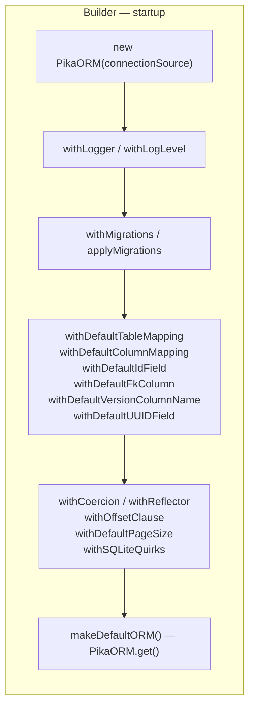

**Test reference:** [`ChinookBeanTest.configureOrm()`](file:///Users/willmitchell/Desktop/Code%20Life/pika-orm/src/test/java/edu/montana/pika/integration/ChinookBeanTest.java#L229-L248) demonstrates a full builder chain with custom FK naming, ID field naming, column mapping, and table mapping.

---

### 3.2 — Connection & Session Layer

PikaORM uses a **thread-local connection stack**. Each query creates or reuses a `ConnectionSession` on the current thread. Sessions are reference-counted so nested calls share one physical connection.

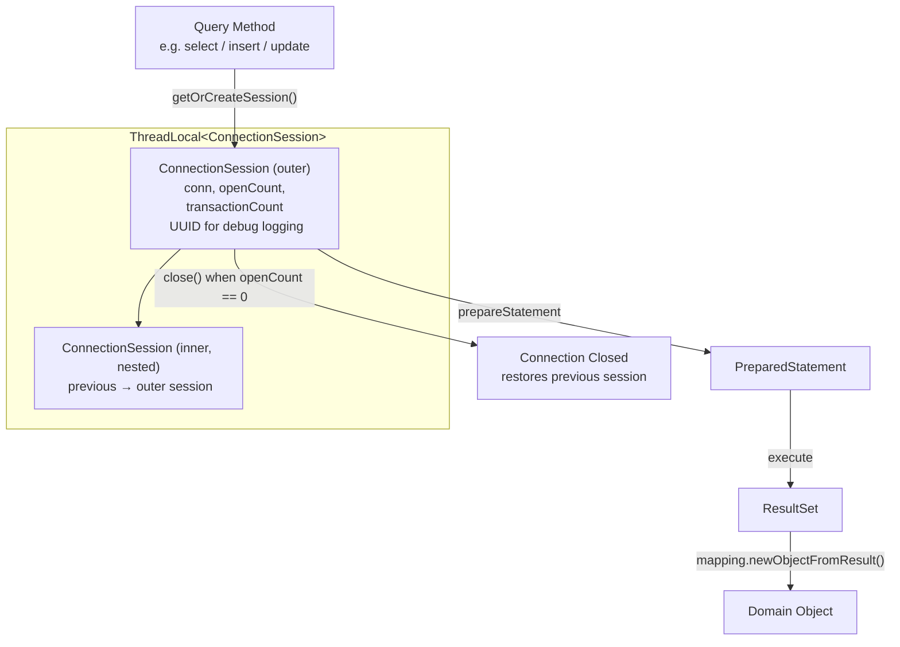

**Key behaviours:**
- `establishConnection()` manually pushes a new session — required before `stream()`.
- `getOrCreateSession()` (private) lazily creates a session per query.
- Closing a session decrements `openCount`; the underlying JDBC `Connection` is only closed when it reaches zero.
- The previous session is automatically restored on close, enabling transparent nesting.

**Test reference:** [`StreamTest`](file:///Users/willmitchell/Desktop/Code%20Life/pika-orm/src/test/java/edu/montana/pika/query/StreamTest.java) demonstrates the required `establishConnection()` call before streaming.

---

### 3.3 — Transaction Management

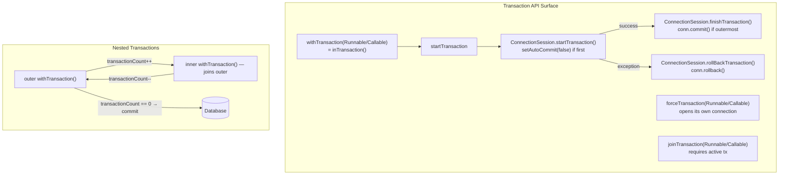

**Key rule:** PikaORM uses a **transaction counter** (`transactionCount`) inside `ConnectionSession`. The physical `COMMIT` fires only when the outermost transaction completes. Nested calls simply join the existing transaction.

**Test reference:** [`TransactionsTest`](file:///Users/willmitchell/Desktop/Code%20Life/pika-orm/src/test/java/edu/montana/pika/features/TransactionsTest.java) — covers basic commit, rollback, nested commit/rollback, `inTransaction`, `joinTransaction`, and `forceTransaction`.

---

### 3.4 — Mapping Subsystem

The mapping subsystem converts Java classes and their fields into SQL tables and columns, and back again.

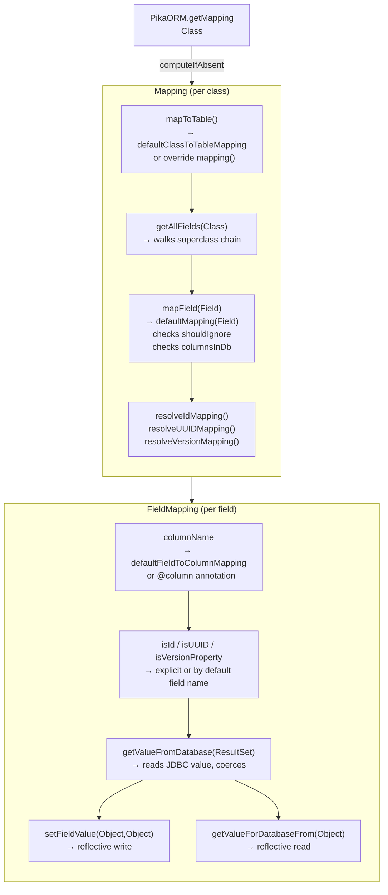

**Class-to-table default:** `ClassName` → `snake_case` → pluralized (e.g. `ArtistBean` → `artist_beans` by default; overridden in Chinook test to `artists`).

**Field-to-column default:** `fieldName` → `snake_case` (e.g. `strVal` → `str_val`; overridden in Chinook test to `capitalize` to match Chinook's `CamelCase` columns).

**Custom mapping via static method:** Any class may declare `public static Mapping mapping()` to return a fully customised `Mapping` instance. PikaORM discovers it via reflection.

**Read-only records:** Java `record` types are treated as read-only; `isReadOnly()` returns `true` and their `id` field is never written back after insert.

**Test reference:** [`ChinookBeanTest.configureOrm()`](file:///Users/willmitchell/Desktop/Code%20Life/pika-orm/src/test/java/edu/montana/pika/integration/ChinookBeanTest.java#L229-L248) — overrides every default mapping strategy. [`SelectTest.testGenericSelectWitRecord()`](file:///Users/willmitchell/Desktop/Code%20Life/pika-orm/src/test/java/edu/montana/pika/core/SelectTest.java#L128-L151) — maps a `GROUP BY` query result into a Java record.

---

### 3.5 — Query Pipeline

This is the most-used path in PikaORM. Three distinct entry points exist, each targeting a different usage level:

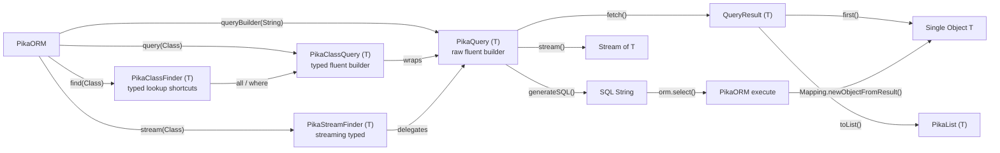

#### PikaClassFinder — Lookup Shortcuts

| Method | Description |
|--------|-------------|
| `byId(Object id)` | `SELECT * FROM table WHERE id=? LIMIT 1` |
| `byKey(String col, Object val)` | `SELECT * FROM table WHERE col=? LIMIT 1` |
| `all()` | Returns a `PikaClassQuery` for all rows |
| `allBy(String col, Object val)` | Returns a `PikaClassQuery` filtered by a single column |
| `firstWhere(String, Map)` | Returns first matching row or `null` |
| `where(String, Map)` | Returns a `PikaClassQuery` with an initial WHERE clause |
| `bySQL(String, Map)` | Raw SQL query mapped to type `T` |
| `count()` / `sum()` / `avg()` / `min()` / `max()` | Aggregate delegates |
| `page(long)` / `join(Class)` | Paging and join delegates |

**Test reference:** [`SelectTest`](file:///Users/willmitchell/Desktop/Code%20Life/pika-orm/src/test/java/edu/montana/pika/core/SelectTest.java)

#### PikaClassQuery — Typed Fluent Builder

Delegates all operations to an inner `PikaQuery<T>`. Extends it with type-safe `join(Class)` which auto-resolves foreign keys.

| Feature | Method |
|---------|--------|
| Filtering | `where`, `orWhere`, `whereIn`, `whereNotIn`, `whereLike`, `orWhereLike` |
| Grouping | `group()`, `orGroup()`, `endGroup()` |
| Joining | `join(Class)`, `join(JoinType, Class)`, `thenJoin(Class)` |
| Sorting | `orderBy(String)`, `orderBy(String, SortOrder)` |
| Paging | `page(long)`, `pageSize(int)` |
| Aggregates | `count()`, `sum()`, `avg()`, `min()`, `max()`, `totalCount()` |
| Execution | `fetch()`, `fetchFirst()`, `fetchList()`, `stream()` |
| Pagination helpers | `isFirstPage()`, `isLastPage()`, `nextPageURL()`, `previousPageURL()` |
| Diagnostics | `explain()`, `generateSQL()` |

**Test reference:** [`ClassQueryTest`](file:///Users/willmitchell/Desktop/Code%20Life/pika-orm/src/test/java/edu/montana/pika/query/ClassQueryTest.java), [`PagingTest`](file:///Users/willmitchell/Desktop/Code%20Life/pika-orm/src/test/java/edu/montana/pika/query/PagingTest.java), [`ChinookBeanTest.testQueryJoin()`](file:///Users/willmitchell/Desktop/Code%20Life/pika-orm/src/test/java/edu/montana/pika/integration/ChinookBeanTest.java#L40-L47)

#### PikaQuery — Generic SQL Builder

The lowest-level fluent query API, used directly for raw SQL (e.g. `queryBuilder("some_view")`). Also the backing implementation for `PikaClassQuery`.

**Named variable substitution:** `:varName` in SQL strings is replaced by `?` at execution time. Collections expand to `(?, ?, ?)`.

**Test reference:** [`PikaQueryBuilderTest`](file:///Users/willmitchell/Desktop/Code%20Life/pika-orm/src/test/java/edu/montana/pika/query/PikaQueryBuilderTest.java)

---

### 3.6 — CRUD Execution Flow


**Test references:**
- Insert: [`InsertTest`](file:///Users/willmitchell/Desktop/Code%20Life/pika-orm/src/test/java/edu/montana/pika/core/InsertTest.java)
- Update: [`UpdateTest`](file:///Users/willmitchell/Desktop/Code%20Life/pika-orm/src/test/java/edu/montana/pika/core/UpdateTest.java)
- Delete: [`DeleteTest`](file:///Users/willmitchell/Desktop/Code%20Life/pika-orm/src/test/java/edu/montana/pika/core/DeleteTest.java)
- Select: [`SelectTest`](file:///Users/willmitchell/Desktop/Code%20Life/pika-orm/src/test/java/edu/montana/pika/core/SelectTest.java)

---

### 3.7 — Relationship System

```mermaid
flowchart TD
    subgraph ONE_MANY ["One-to-Many: orm.loadMany(one, ManyClass)"]
        OM1["Mapping.getDefaultForeignKeyColumnName()\ne.g. artist → artist_id on albums"]
        OM1 --> OM2["PikaManyRelation(one, classOfMany, manyFk, orm)"]
        OM2 --> OM3["toQuery()\nquery(classOfMany).where('manyFk=:id', id)"]
        OM3 --> OM4["lazy load on iterator()\nor size()"]
    end

    subgraph MANY_THROUGH ["Many-to-Many: orm.loadManyThrough(one, JoinClass, ManyClass)"]
        MT1["Derives oneFk from one's class\nDerives manyFk from ManyClass"]
        MT1 --> MT2["PikaManyThroughRelation(one,oneFk,joinClass,classOfMany,manyFk,orm)"]
        MT2 --> MT3["toQuery()\nquery(classOfMany)\n  .join(joinClass)\n  .thenJoin(one.class)\n  .where(oneTable.id = :id)"]
        MT3 --> MT4["lazy load on iterator()\nor size()"]
    end

    subgraph LOAD_ONE ["load(objectWithFk, TargetClass)"]
        L1["Mapping.getValueForColumn(obj, fkColumn)\n→ reads FK value from object"]
        L1 --> L2["find(TargetClass).byId(fkValue)"]
    end

    subgraph LOAD_REVERSE ["loadReverse(objectWithPk, TargetClass)"]
        LR1["Mapping.getId(objectWithPk)\n→ reads PK value"]
        LR1 --> LR2["find(TargetClass).byKey(fkColumn, pkValue)"]
    end
```

**`PikaManyRelation` key methods:**

| Method | Description |
|--------|-------------|
| `add(T)` | Sets the FK field on `newMember` to `one`'s PK. Does **not** save. |
| `addAndSave(T)` | Calls `add()` then persists (via `save()` for EPB or `insert()`/`update()` otherwise). |
| `create()` | Creates a new instance with FK pre-set. |
| `findById(long)` | Finds a specific member within this relation by its PK. |
| `toQuery()` | Returns a `PikaClassQuery` for further filtering. |
| `reload()` | Clears the cached result; next iteration re-queries. |

**`PikaManyThroughRelation` key methods:**

| Method | Description |
|--------|-------------|
| `add(T)` | Creates a join-table instance with both FKs set. Does **not** save. |
| `addAndSave(T)` | Calls `add()` then persists the join object. |
| `remove(T)` | Deletes matching join-table rows. |
| `toQuery()` | Returns a `PikaClassQuery<T>` joining through the join table. |

**Test references:**
- One-to-many: [`OnetoNTest`](file:///Users/willmitchell/Desktop/Code%20Life/pika-orm/src/test/java/edu/montana/pika/relationships/OnetoNTest.java), [`ChinookBeanTest.testJoin()`](file:///Users/willmitchell/Desktop/Code%20Life/pika-orm/src/test/java/edu/montana/pika/integration/ChinookBeanTest.java#L32-L37)
- Many-to-many: [`ManyToManyTest`](file:///Users/willmitchell/Desktop/Code%20Life/pika-orm/src/test/java/edu/montana/pika/relationships/ManyToManyTest.java), [`ChinookBeanTest.testNtoNLoad()`](file:///Users/willmitchell/Desktop/Code%20Life/pika-orm/src/test/java/edu/montana/pika/integration/ChinookBeanTest.java#L104-L109)

---

### 3.8 — EnterprisePikaBean: Active-Record Layer

`EnterprisePikaBean` (EPB) is an optional base class that wires a domain object directly into PikaORM via the default static `PikaORM.get()`.

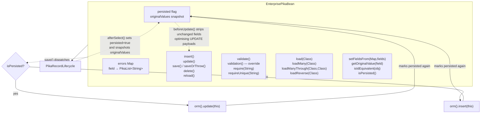

**Dirty-field optimisation:** `beforeUpdate()` compares the current field map against `originalValues` (captured at select-time or after the last write). Fields whose value is unchanged are silently removed from the `UPDATE` payload, minimising unnecessary DB writes.

**Error API:**

| Method | Description |
|--------|-------------|
| `addError(String field, String msg)` | Attaches a field-scoped error |
| `addError(String msg)` | Attaches a general (non-field) error |
| `hasErrors()` | Returns `true` if any error is present |
| `getErrors(String field)` | Returns all errors for a specific field |
| `getGeneralErrors()` | Returns non-field errors |
| `getAllFieldErrors()` | Returns a sorted map of all field errors |
| `getErrorString(String field)` | Joins field errors with `, ` |

**Test references:** [`ChinookBeanTest.testTrackValidationFailsWithNullName()`](file:///Users/willmitchell/Desktop/Code%20Life/pika-orm/src/test/java/edu/montana/pika/integration/ChinookBeanTest.java#L172-L177), [`ChinookBeanTest.testCustomerValidationFailsWithInvalidEmail()`](file:///Users/willmitchell/Desktop/Code%20Life/pika-orm/src/test/java/edu/montana/pika/integration/ChinookBeanTest.java#L202-L209)

---

### 3.9 — Lifecycle Callback System

`PikaRecordLifecycle` is implemented either directly on any POJO or by extending `EnterprisePikaBean`.

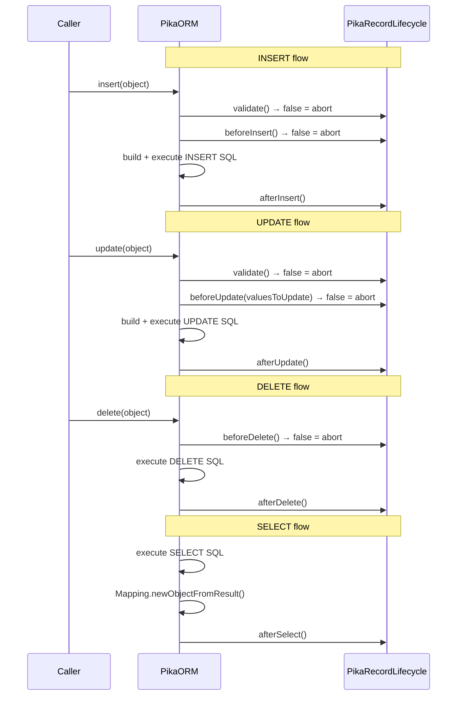

> [!NOTE]
> Returning `false` from `validate()`, `beforeInsert()`, `beforeUpdate()`, or `beforeDelete()` causes the operation to **abort silently** (returns `null` or `false`). No exception is thrown. For EPB subclasses, `saveOrThrow()` will throw `IllegalStateException` if the operation fails.

---

### 3.10 — Coercion System

PikaORM converts JDBC values (which are database-driver dependent) to the target Java field type through a layered coercion pipeline.

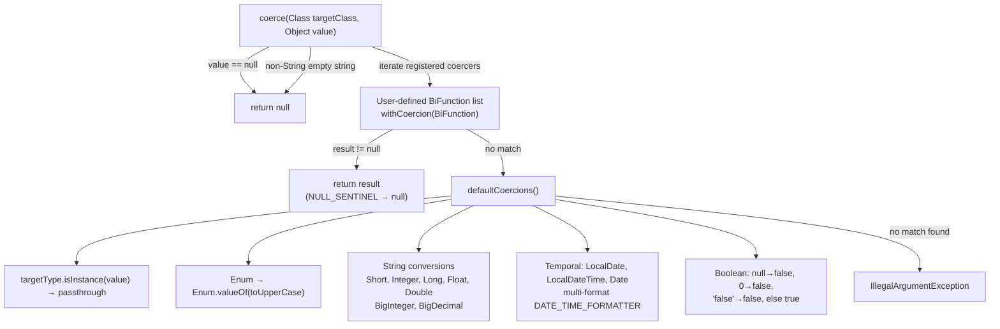

**`sloppyCoerce()`** is a tolerant variant: if the primary coercion fails and the value is not already a String, it converts the value to `String` first and retries. Used internally for web form binding via `setFieldsFrom()`.

**Test reference:** [`CoercionsTest`](file:///Users/willmitchell/Desktop/Code Life/pika-orm/src/test/java/edu/montana/pika/core/CoercionsTest.java), [`DataTypesTest`](file:///Users/willmitchell/Desktop/Code Life/pika-orm/src/test/java/edu/montana/pika/core/DataTypesTest.java)

---

### 3.11 — Query Cache System

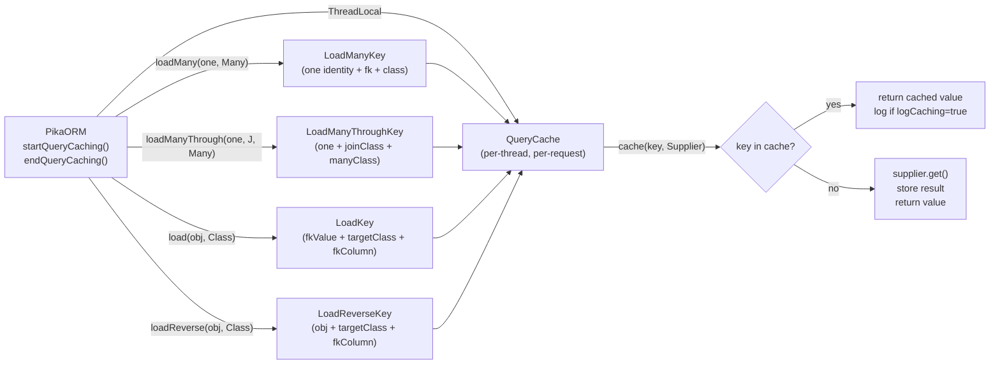

**Usage pattern:**
```java
orm.startQueryCaching();
try {
    // all loadMany / load / loadReverse calls are cached within this block
    for (Artist artist : artists) {
        artist.getAlbums(); // only queries DB once per artist
    }
} finally {
    orm.endQueryCaching();
}
```

**`clearQueryCache()`** invalidates all entries without ending the caching session, useful after write operations within the same request.

---

### 3.12 — Migrations Subsystem

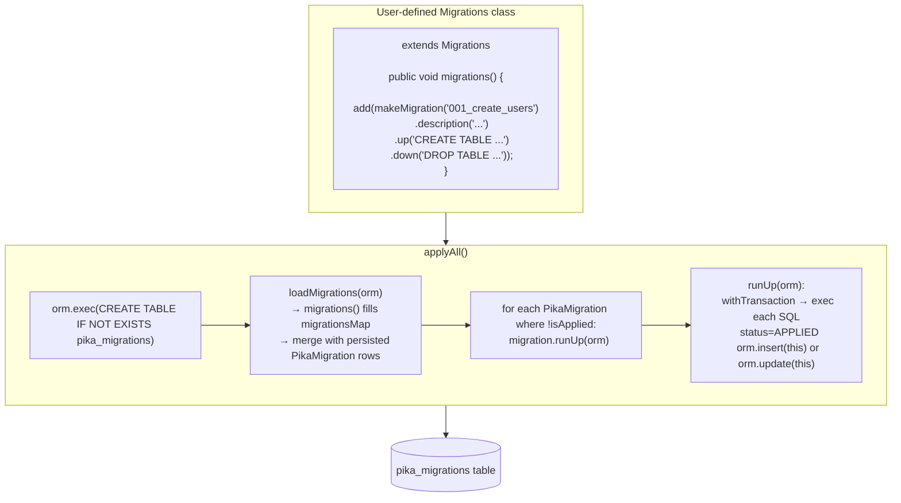

**Migration console commands:**

| Command | Action |
|---------|--------|
| `show` | Tabular display of all migrations and their status |
| `all` | Apply all pending migrations |
| `up` | Apply the next single pending migration |
| `down` | Roll back the most recently applied migration |
| `exit` / `quit` | Exit the console |

**Test reference:** [`MigrationsTest`](file:///Users/willmitchell/Desktop/Code Life/pika-orm/src/test/java/edu/montana/pika/features/MigrationsTest.java)

---

### 3.13 — Optimistic Concurrency Control

When a class has a field named `version` (or configured via `withDefaultVersionColumnName`), PikaORM automatically enforces optimistic locking.

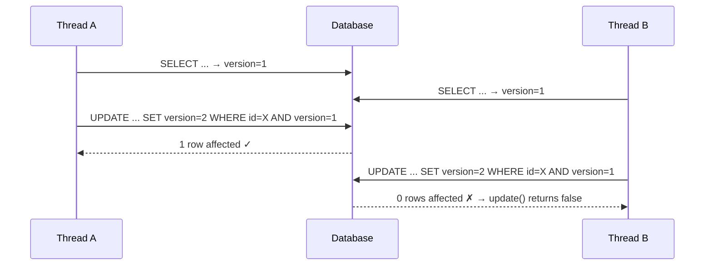

**Version incrementer default:** `previousValue == null → 1`; otherwise `((Long) previousValue) + 1`. Fully customisable via `withDefaultVersionIncrementer()`.

**Test reference:** [`OptimisticConcurrencyTest`](file:///Users/willmitchell/Desktop/Code Life/pika-orm/src/test/java/edu/montana/pika/features/OptimisticConcurrencyTest.java)

---

### 3.14 — Logging System

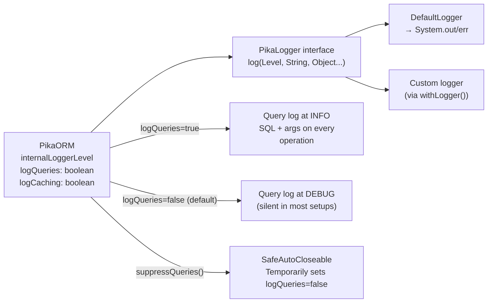

**Log levels:** `TRACE`, `DEBUG`, `INFO`, `WARN`, `ERROR`

**Test reference:** [`LoggingTest`](file:///Users/willmitchell/Desktop/Code Life/pika-orm/src/test/java/edu/montana/pika/features/LoggingTest.java)

---

### 3.15 — Streaming API

The streaming path bypasses `PikaList` and returns a lazy `java.util.stream.Stream<T>`. It requires a caller-managed connection.

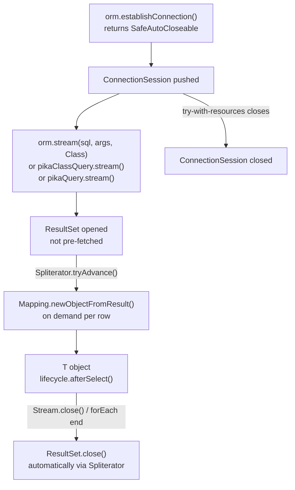

> [!IMPORTANT]
> You **must** call `orm.establishConnection()` and keep the returned `SafeAutoCloseable` open in a try-with-resources block for the entire duration of stream consumption. The stream holds an open `ResultSet` that depends on the connection.

**Test reference:** [`StreamTest`](file:///Users/willmitchell/Desktop/Code Life/pika-orm/src/test/java/edu/montana/pika/query/StreamTest.java)

---

### 3.16 — Paging API

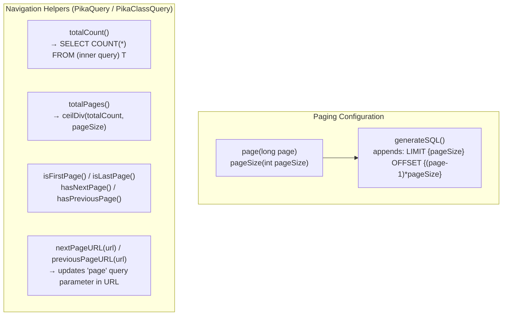

**Test reference:** [`PagingTest`](file:///Users/willmitchell/Desktop/Code Life/pika-orm/src/test/java/edu/montana/pika/query/PagingTest.java), [`ChinookBeanTest.testPaging()`](file:///Users/willmitchell/Desktop/Code%20Life/pika-orm/src/test/java/edu/montana/pika/integration/ChinookBeanTest.java#L50-L54)

---

## 4. Feature-to-Entry-Point Map (Quick Reference)

| Feature | Entry Point | Returns |
|---------|-------------|---------|
| Find by PK | `orm.find(C).byId(id)` | `T` or `null` |
| Find by column | `orm.find(C).byKey(col, val)` | `T` or `null` |
| Query all | `orm.find(C).all()` | `PikaClassQuery<T>` |
| Filtered query | `orm.find(C).where(sql, Map)` | `PikaClassQuery<T>` |
| Raw typed query | `orm.find(C).bySQL(sql, Map)` | `QueryResult<T>` |
| Raw untyped query | `orm.select(sql, Map)` | `QueryResult<ResultMap>` |
| Streaming | `orm.stream(C)` or `query.stream()` | `Stream<T>` |
| Insert one | `orm.insert(obj)` | `Long` (generated PK) |
| Insert many | `orm.insertAll(list)` | `void` |
| Update | `orm.update(obj)` | `boolean` |
| Delete | `orm.delete(obj)` | `boolean` |
| Reload from DB | `orm.reload(obj)` | `void` |
| Raw SQL | `orm.exec(sql)` | `boolean` |
| One-to-many | `orm.loadMany(one, ManyClass)` | `PikaManyRelation<T>` |
| Many-to-many | `orm.loadManyThrough(one, JoinClass, ManyClass)` | `PikaManyThroughRelation<J,T>` |
| Belongs-to | `orm.load(obj, TargetClass)` | `T` |
| Has-one reverse | `orm.loadReverse(obj, TargetClass)` | `T` |
| Transaction | `orm.withTransaction(Runnable)` | `void` |
| Transaction (return) | `orm.withTransaction(Callable)` | `T` |
| Force new connection tx | `orm.forceTransaction(Runnable)` | `void` |
| Join existing tx | `orm.joinTransaction(Runnable)` | `void` |
| Caching on | `orm.startQueryCaching()` | `void` |
| Caching off | `orm.endQueryCaching()` | `void` |
| Migrations | `orm.withMigrations(m).applyMigrations()` | `PikaORM` (fluent) |
| Type coercion | `orm.coerce(Class, value)` | `T` |

---

## 5. Test Suite Index

| Test Class | Package | Features Covered |
|------------|---------|-----------------|
| [`SelectTest`](file:///Users/willmitchell/Desktop/Code%20Life/pika-orm/src/test/java/edu/montana/pika/core/SelectTest.java) | `core` | byId, firstWhere, all, where, in-clause, raw select, records |
| [`InsertTest`](file:///Users/willmitchell/Desktop/Code%20Life/pika-orm/src/test/java/edu/montana/pika/core/InsertTest.java) | `core` | insert, insertAll, UUID generation |
| [`UpdateTest`](file:///Users/willmitchell/Desktop/Code%20Life/pika-orm/src/test/java/edu/montana/pika/core/UpdateTest.java) | `core` | update, dirty-field optimisation |
| [`DeleteTest`](file:///Users/willmitchell/Desktop/Code%20Life/pika-orm/src/test/java/edu/montana/pika/core/DeleteTest.java) | `core` | delete, beforeDelete abort |
| [`CoercionsTest`](file:///Users/willmitchell/Desktop/Code%20Life/pika-orm/src/test/java/edu/montana/pika/core/CoercionsTest.java) | `core` | Type coercion, sloppyCoerce |
| [`DataTypesTest`](file:///Users/willmitchell/Desktop/Code%20Life/pika-orm/src/test/java/edu/montana/pika/core/DataTypesTest.java) | `core` | All mapped SQL types |
| [`ClassQueryTest`](file:///Users/willmitchell/Desktop/Code%20Life/pika-orm/src/test/java/edu/montana/pika/query/ClassQueryTest.java) | `query` | PikaClassQuery full API |
| [`PagingTest`](file:///Users/willmitchell/Desktop/Code%20Life/pika-orm/src/test/java/edu/montana/pika/query/PagingTest.java) | `query` | page, pageSize, totalPages, URL helpers |
| [`PikaQueryBuilderTest`](file:///Users/willmitchell/Desktop/Code%20Life/pika-orm/src/test/java/edu/montana/pika/query/PikaQueryBuilderTest.java) | `query` | Raw PikaQuery builder |
| [`StreamTest`](file:///Users/willmitchell/Desktop/Code%20Life/pika-orm/src/test/java/edu/montana/pika/query/StreamTest.java) | `query` | Streaming with establishConnection |
| [`TransactionsTest`](file:///Users/willmitchell/Desktop/Code%20Life/pika-orm/src/test/java/edu/montana/pika/features/TransactionsTest.java) | `features` | All transaction variants |
| [`OptimisticConcurrencyTest`](file:///Users/willmitchell/Desktop/Code%20Life/pika-orm/src/test/java/edu/montana/pika/features/OptimisticConcurrencyTest.java) | `features` | Version column, lost-update detection |
| [`MigrationsTest`](file:///Users/willmitchell/Desktop/Code%20Life/pika-orm/src/test/java/edu/montana/pika/features/MigrationsTest.java) | `features` | Migration apply, status, rollback |
| [`LoggingTest`](file:///Users/willmitchell/Desktop/Code%20Life/pika-orm/src/test/java/edu/montana/pika/features/LoggingTest.java) | `features` | Logger levels, query logging |
| [`ExplainTest`](file:///Users/willmitchell/Desktop/Code%20Life/pika-orm/src/test/java/edu/montana/pika/features/ExplainTest.java) | `features` | Query EXPLAIN output |
| [`OnetoNTest`](file:///Users/willmitchell/Desktop/Code%20Life/pika-orm/src/test/java/edu/montana/pika/relationships/OnetoNTest.java) | `relationships` | loadMany, add, addAndSave |
| [`ManyToManyTest`](file:///Users/willmitchell/Desktop/Code%20Life/pika-orm/src/test/java/edu/montana/pika/relationships/ManyToManyTest.java) | `relationships` | loadManyThrough, add, remove |
| [`ChinookBeanTest`](file:///Users/willmitchell/Desktop/Code%20Life/pika-orm/src/test/java/edu/montana/pika/integration/ChinookBeanTest.java) | `integration` | Full EPB with real SQLite DB, joins, paging, validation |
| [`ChinookTest`](file:///Users/willmitchell/Desktop/Code%20Life/pika-orm/src/test/java/edu/montana/pika/integration/ChinookTest.java) | `integration` | Raw ORM (non-EPB) against real DB |
