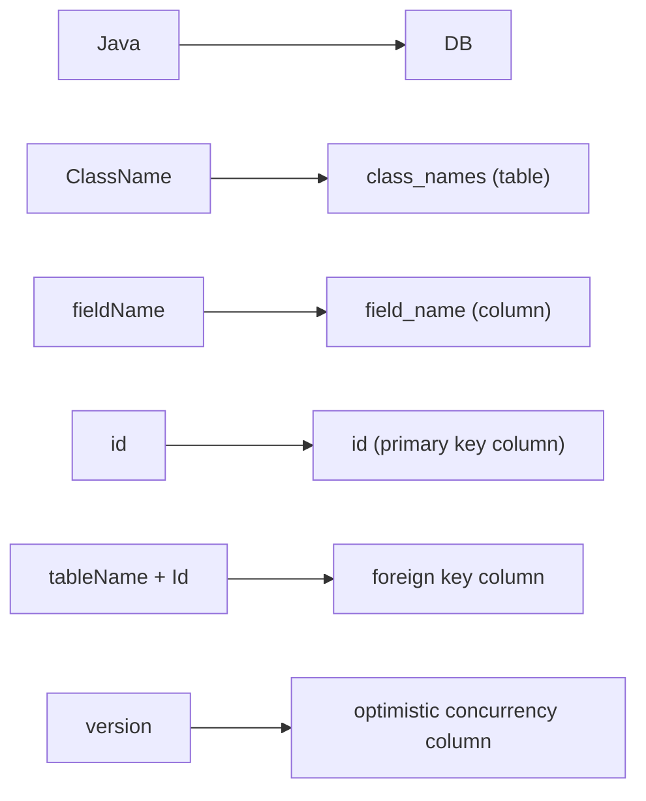

# Welcome to the PikaORM Web QuickStart!

> Your one-stop guide to get a working Java web application talking to a database with PikaORM. We cover the essentials in order migrations, your domain object, and all four CRUD operations then finish with joins.

PikaORM is designed to be stumbled into. Almost everything is discoverable through method chaining, and there are no external config files or annotations required. Let's get started.

---

## Setting Up Migrations

Migrations are how you define and manage your database schema entirely in code. You create a class that extends `Migrations`, override the `migrations()` method, and add one `PikaMigration` entry per schema change.

```java
public class AppMigrations extends Migrations {

    @Override
    public void migrations() {
        add(this::createTodosTable);
    }

    public PikaMigration createTodosTable() {
        return makeMigration("001_create_todos")
                .up("""
                        CREATE TABLE IF NOT EXISTS todos (
                            id        INTEGER PRIMARY KEY,
                            title     TEXT,
                            description TEXT,
                            due_date  TEXT,
                            completed INTEGER
                        );
                        """)
                .down("DROP TABLE todos;");
    }
}
```

`migrations()` is called by Pika to collect your migration definitions. Each call to `add()` registers one `PikaMigration`  a named unit of work with an `up` (apply) and `down` (rollback) SQL block. You write your own DDL; Pika handles execution order, tracking, and idempotency.

> **`up` and `down`** are the standard migration conventions: `up` creates or alters, `down` undoes it. Pika records every applied migration in a `pika_migrations` table so re-running `applyAll()` is always safe 1already-applied migrations are skipped automatically.

Multiple SQL statements within a single `up` or `down` block are supported. Separate them with semicolons and Pika will execute each one in order within a transaction.

---

## Wiring the ORM to Your Migrations

You have two options for applying migrations at startup.

**Option A — apply immediately (typical for a web server startup):**

```java
public static void main(String[] args) {
    PikaORM orm = new PikaORM("jdbc:sqlite:app.db")
            .withLogLevel(TRACE)
            .makeDefaultORM()
            .withMigrations(new AppMigrations())
            .applyMigrations();
}
```

**Option B — interactive CLI (useful during development):**

```java
public static void main(String[] args) {
    PikaORM orm = new PikaORM("jdbc:sqlite:app.db")
            .withLogLevel(TRACE)
            .makeDefaultORM();

    AppMigrations migrations = new AppMigrations();
    orm.withMigrations(migrations);
    migrations.console(); // boots an interactive CLI
}
```

The console gives you fine-grained control:

```
migrations > ?
Migrations Commands
  show      - show all migrations and their status
  up        - apply the next pending migration
  down      - roll back the most recently applied migration
  all       - apply all pending migrations
  exit/quit - exit this tool
  help/?    - show this help message
```

---

## Your Domain Object

A domain object in Pika is a **plain Java class** no base class or interface required. Pika reads and writes fields directly via reflection, so all you need is a no-arg constructor and your fields.

```java
public class Todo {

    Long id;
    String title;
    String description;
    Date dueDate;
    Boolean completed;

    public Todo() {}

    public Todo(String title, String description) {
        this.title = title;
        this.description = description;
    }

    public Long getId()                     { return id; }
    public String getTitle()               { return title; }
    public void setTitle(String title)     { this.title = title; }
    public String getDescription()         { return description; }
    public void setDescription(String d)   { this.description = d; }
    public Date getDueDate()               { return dueDate; }
    public void setDueDate(Date dueDate)   { this.dueDate = dueDate; }
    public Boolean getCompleted()          { return completed; }
    public void setCompleted(Boolean c)    { this.completed = c; }
}
```

> Getters and setters are optional for Pika itself as it accesses fields directly. They are shown here because your web framework likely needs them.

---

## Default Database Mapping

Pika automatically converts between Java naming conventions and SQL conventions. You don't need to configure anything for a fresh database.



So `Todo` maps to the `todos` table, and `dueDate` maps to the `due_date` column automatically. If you are working with an existing database that uses different conventions, Pika has a full suite of mapping overrides (see the Advanced Customization guide).

---

## Basic CRUD

### INSERT

```java
PikaORM orm = new PikaORM("jdbc:sqlite:app.db")
        .withLogLevel(TRACE)
        .makeDefaultORM()
        .withMigrations(new AppMigrations())
        .applyMigrations();

// Insert multiple rows in one database round-trip
orm.insertAll(
    new Todo("Buy groceries", "Milk, eggs, bread"),
    new Todo("Read docs",     "Finish the PikaORM guide"),
    new Todo("Write tests",   "Cover the happy path")
);

// Insert a single row — returns the generated primary key
Todo single = new Todo("Deploy app", "Push to production");
long generatedId = orm.insert(single);
// single.getId() is also updated automatically after insert
```

`insertAll` sends a single `INSERT` statement with multiple `VALUES` rows much more efficient than calling `insert` in a loop when you have many objects. Any fields left `null` at insertion time are stored as `NULL` in the database.

---

### SELECT

**Typed query — results mapped directly to your class:**

```java
// All rows
PikaList<Todo> all = orm.find(Todo.class).all().toList();

// Filtered — :val is a named parameter, replaced safely with a prepared statement
PikaList<Todo> active = orm.query(Todo.class)
        .where("completed = :val", "val", false)
        .fetchList();

// Single object by primary key — returns null if not found
Todo todo = orm.find(Todo.class).byId(1L);

// Single object by any column
Todo byTitle = orm.find(Todo.class).byKey("title", "Buy groceries");
```

`orm.query()` returns a `PikaClassQuery` which is a fluent builder you can chain `.where()`, `.orderBy()`, `.page()`, and other clauses onto before executing. 

> [!IMPORTANT]
>
> Note the way we are collecting results into lists as is very typical for database querying.
>
> - `.fetch()` (returns `QueryResult<T>`, which adds `reload()`) to execute.
>
>   | Methods on `fetch()`         | What it does                                                 |
>   | :--------------------------- | :----------------------------------------------------------- |
>   | `result.reload()`            | Re-runs the original SQL against the DB, refreshing stale data |
>   | `result.getAsReadOnlyList()` | Returns an unmodifiable view which is safe to pass to code you don't want mutating the list |
>   | `result.copy()`              | Shallow-copies the result set                                |
>
> - `.toList()` (returns `PikaList<T>`)
>
> - `.fetchList()` (returns `PikaList<T>`) and is a combination of `.fetch()` and `.toList()`
>
> Both methods will ultimately melt into `.toList()`
>
> ```java
> // Option A — two steps (explicit)
> QueryResult<Todo> result = orm.query(Todo.class).where(...).fetch();
> PikaList<Todo> list = result.toList();
> 
> // Option B — fetchList() (one step shortcut)
> PikaList<Todo> list = orm.query(Todo.class).where(...).fetchList();
> 
> // Option C — from PikaClassFinder
> PikaList<Todo> list = orm.find(Todo.class).where(...).toList();
> ```
>
> 

**Named parameters** use the `:variableName` syntax inside your SQL string. You supply the value either inline as a second argument, via `Map.of("name", value)`, or with `.withVar("name", value)` on the query:

```java
// Three equivalent ways to supply a parameter
orm.query(Todo.class).where("title = :val", "val", "Buy groceries").fetchList();
orm.query(Todo.class).where("title = :val", Map.of("val", "Buy groceries")).fetchList();
orm.query(Todo.class).where("title = :val").withVar("val", "Buy groceries").fetchList();
```

**Raw SQL — when you need full control:**

```java
// No class → rows come back as ResultMap (a Map<String, Object>)
PikaList<ResultMap> rows = orm.select("SELECT * FROM todos").toList();
String title = rows.get(0).getString("title");

// With a class → rows are still mapped to your type
PikaList<Todo> todos = orm.select("SELECT * FROM todos WHERE completed = 0", Todo.class).toList();
```

*Where did that `getString` method come from?*

> [!IMPORTANT]
>
> Notice when we do no have a notion of collecting a particular class, our default is this weird and general `ResultMap` type that is provided from the JDBC driver. Below is a easy way to know how to treat your queries and what methods you have access to.
>
> If you have any list with return type of a pika defined POJO class, you are able to use your own defined methods in your class (in this case our `Todo` object) to access and understand data. If you have a `ResultMap` you must use default methods for data retrieval and know the mapped values of your Object fields in the database:
>
> ```java
> ResultMap row = results.first();
> Long id           = row.getLong("id");           // primary key
> String title      = row.getString("title");
> String desc       = row.getString("description");
> Date dueDate      = row.getDate("due_date");     // dueDate → due_date column
> Boolean completed = row.getBoolean("completed");
> ```
>
> An easy guide can be found below to understanding result typing:
>
> ```java
> Do you know the class at compile time?
> │
> ├─ YES → orm.find(MyClass.class) / orm.query(MyClass.class)
> │         returns QueryResult<MyClass> (From fetch, not a list until turned with fetchList or toList) / PikaList<MyClass>
> │         → access via your own getters (myObj.getTitle(), etc.)
> │
> └─ NO  → orm.select("SELECT ...")
> │         returns QueryResult<ResultMap> / PikaList<ResultMap>
> │         → access via row.getString("col") / row.asLong("col")
> │
> JOIN queries → still typed (returns QueryResult<MyClass>)
>               the JOIN affects SQL only, not the return type
> 

---

### UPDATE

```java
// Fetch the object you want to change
Todo todo = orm.find(Todo.class).byId(1L);

// Mutate it - These methods are user defined fields on the the object Todo
todo.setCompleted(true);
todo.setDueDate(new Date());

// Persist the change — returns true if a row was updated, false if the id wasn't found
boolean updated = orm.update(todo);
```

Pika builds an `UPDATE` statement covering every mapped field and targets the row by its primary key.

---

### DELETE

```java
Todo toRemove = orm.find(Todo.class).byId(1L);

// Returns true if the row was deleted, false if it wasn't found
boolean deleted = orm.delete(toRemove);
```

> `delete` targets the row by the object's primary key value. Always fetch the object first (or ensure its `id` field is set) deleting an object whose `id` is `null` is a no-op. 

---

## Full CRUD Example

Putting it all together in one block for reference:

```java
public static void main(String[] args) {
    PikaORM orm = new PikaORM("jdbc:sqlite:app.db")
            .withLogLevel(TRACE)
            .makeDefaultORM()
            .withMigrations(new AppMigrations())
            .applyMigrations();

    // INSERT
    orm.insertAll(
        new Todo("Todo 1", "First task"),
        new Todo("Todo 2", "Second task"),
        new Todo("Todo 3", "Third task")
    );
    orm.insert(new Todo("Todo 4", "Fourth task"));

    // SELECT all
    PikaList<Todo> all = orm.find(Todo.class).all().toList();
    for (Todo t : all) {
        System.out.println(t.getTitle());
    }

    // UPDATE — set the due date on the first result
    Todo first = all.get(0);
    first.setDueDate(new Date());
    boolean updated = orm.update(first);

    // Confirm the change by re-fetching
    Todo reloaded = orm.find(Todo.class).byId(first.getId());
    System.out.println("Due: " + reloaded.getDueDate());

    // DELETE
    boolean deleted = orm.delete(reloaded);
}
```

---

## Joins

When your data spans multiple tables, use `.join()` to pull them together in a single query. Pika auto-resolves the foreign key relationship between classes based on your mapping configuration.

```java
// Imagining Todo has a foreign key to Checklist, which has a foreign key to Calendar
PikaList<Todo> result = orm.query(Todo.class)
        .join(Checklist.class)       // JOIN todos → checklists
        .thenJoin(Calendar.class)    // JOIN checklists → calendars
        .where("todos.title = :title")
        .withVar("title", "Learn about PikaORM")
        .fetchList();
```

`.join(Class)` adds the first joined table. `.thenJoin(Class)` chains from the most recently joined table useful for multi-hop relationships. The result type stays `PikaList<Todo>` Pika maps columns back to your primary class.

---

That covers the essentials of PikaORM for a web application. From here, check out:

- **Feature Guides** — transactions, optimistic locking, query caching, streaming
- **Advanced Customization** — custom column/table mappings, type transformations, lifecycle hooks
- **EnterprisePikaBean** — if you want `save()` and `delete()` directly on your domain objects
