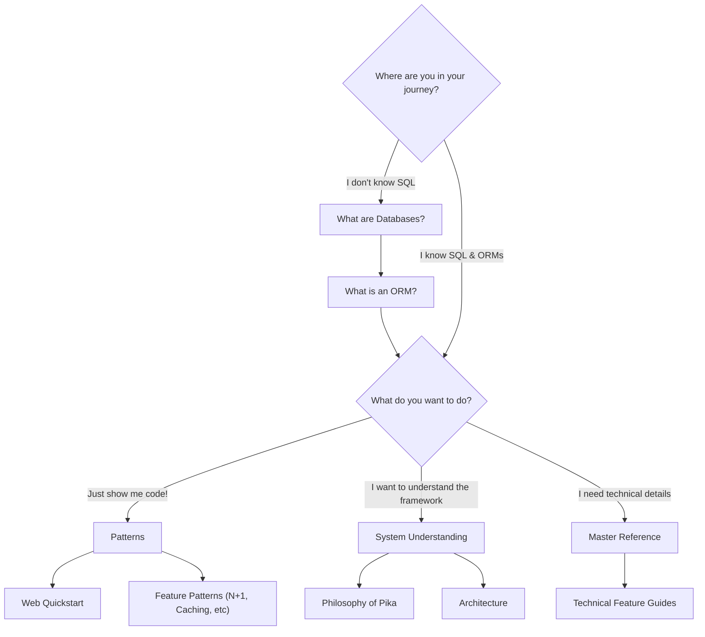

# Welcome to PikaORM

PikaORM is a lightweight, conceptual Object Relational Mapper for Java.

## Why PikaORM

Check out our [Philosophy of Pika]({{ site.baseurl }}/docs_draft/References/System%20Understanding/philosophy-of-pika.md) page to see why we think Pika is useful.

## Core Essentials

**1. Concision is key.**
Pika approaches the ORM problem with simplicity, which means:
- No external configuration files or annotations.
- Intuitive builder method-based API design.
- Highly customizable mappings, models, and features all using plain Java classes.
- An easy to understand codebase for personal modification.

**2. Pika exposes SQL.**
If you cannot do something simplistically with Pika logic, you are encouraged to use raw SQL. You are given multiple entry points to do this directly within the ORM.

**3. Dual database mapping paradigms.**
Pika provides both a SQL-native paradigm and a POJO (Plain Old Java Object) leaning side. These are not mutually exclusive. You are encouraged to use both approaches as your domain requires.

## Supported Databases

- **SQLite**: Must use `.withSQLiteQuirks()` on ORM configuration for small corner cases.
- **H2**: Supports In-Memory, Oracle, PostgreSQL, and SQLServer dialects.
- **MariaDB**: Supported with standard JDBC usage.

## Navigation Guide

Are you new to databases or ORMs? Check out our beginner guides to understand the core concepts. If you already know SQL and ORMs, follow the chart below to find what you need.

