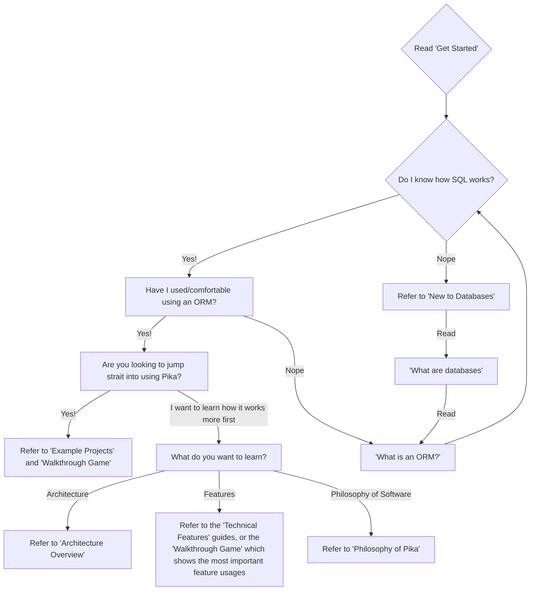

> Ahh yes, just what we need: another ORM....

# Welcome to PikaORM, the lightweight, MicroORM!🐭 

## Why Pika...?

Check out our [Philosophy of Pika](./philosophy-of-pika.md) page to see why we think pika is useful

## **The Need-To-Know Pika Essentials before you scurry 🐁💨 to your first project...**

#### 1. **Concision is king.**

- Pika approaches the ORM problem with [simplicity](grugbrain.dev) which means:
  - No config files.
  - Intuitive builder-method based API design that is ***all code.***
  - Vast customizable mappings/models/features all using plain java classes.
  - Easy to understand code base for personal modification.

### 2. Pika doesn't hide much SQL from you

- if you cannot do something *simplistically* with Pika logic, you are encouraged to using raw SQL *(You are given many ways to do this)*!

### 3. Pika has two *flavors* of database mapping features. 

- A more SQL native paradigm, and a POJO [(Plain ole' Java Objects)](https://en.wikipedia.org/wiki/Plain_old_Java_object) object leaning side. These are by no means exclusive features in usage, and in fact you are encouraged to used both ideas for different things!

> Found below are all the following quick starts one would need to jump strait into Pika usage with there given database type in a web application. *NOTE:* We will take requests, and changes for specific type databases at our own discretion! If you really really want something added, add it yourself you are smart!

### Supported databases (UPDATED)

- **SQLite** (Must use .sqlLiteQuirks() on ORM configuration for small corner cases, most native to PikaORM)

- **H2** (In Memory, Oracle, PostgreSQL, SQLServer)

- **MariaDB** (Has some small problems with `insertAll` so maybe avoid!)

> Are you looking at all of this going, what the *dookie* does this all mean, **why and what is an ORM**? Check out are super uber beginner guide get started, I promise it's not that tough :)

