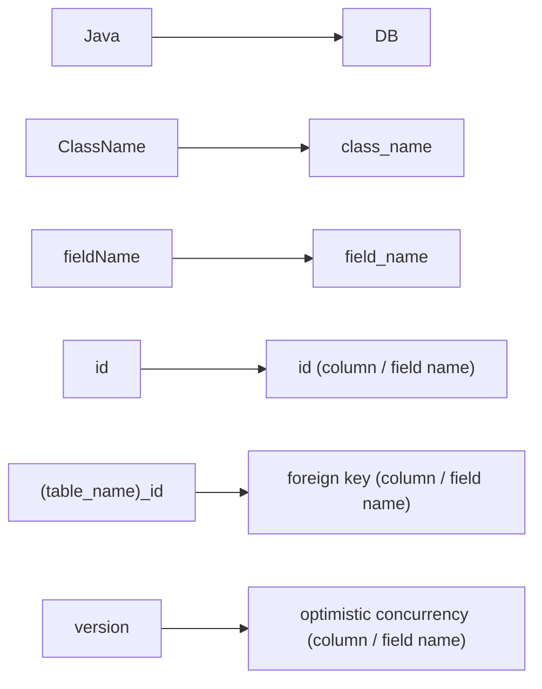

# Welcome to the PikaORM Web-QuickStart!

> This page should be your one stop shop for getting starting use Pika, as well getting familiar with the features of this MicroORM 🐁! The writing convention is to write descriptions and references to code *below* code blocks unless specified in the note.


You are encouraged to play around to get comfortable using the method-builder design style we have chosen. Almost everything can be stumbled into with Pika, and all core elements of the API use an object method to execute features as there are no external configs. 

## Getting your project migrated

> Below is a standard implementation of a migration setup done all in code. We use simple notion of extensions to allow users to customize there migration setup, and have full control over there migrations with method tools

``````java
public class MigrationsFile1 extends Migrations {

    @Override
    public void migrations() {   
        add(this::addMigrationDemoTable);
    }

    public PikaMigration addMigrationDemoTable() {
        return makeMigration("migration1") 
                .up("""
                        CREATE TABLE IF NOT EXISTS migration_demo_models (
                            id INTEGER PRIMARY KEY,
                            str_val TEXT,
                            int_val INTEGER,
                            bool_val BOOLEAN,
                            date_val DATETIME
                        );
                        """)
                .down("""
                        DROP TABLE migration_demo_models;
                        """);
    }


}
``````

> Lets break this down 🧀

```java
@Override
    public void migrations() {   
        add(this::addMigrationDemoTable);
    }
```

> We override the migrations method which is left blank in the ORM by default, so we can add each new migration as a `PikaMigration` object enabling us to easily manipulate our migrations with methods when we need. 

```java
.up("""
		//Your own written DDL schema below VVVV
        CREATE TABLE IF NOT EXISTS migration_demo_models (
            id INTEGER PRIMARY KEY,
            str_val TEXT,
            int_val INTEGER,
            bool_val BOOLEAN,
            date_val DATETIME
        );
        
        """)
.down("""
		//Your own written DDL schema for the table breakdown VVV
        DROP TABLE migration_demo_models;
        
        """);
```

> Conventions of up and down are common in the ORM world and we haven't changed them. `up` and `down` in the migration world for Pika are executions of *[DDL Schemes](https://en.wikipedia.org/wiki/Data_definition_language)* for creating and breaking down a table inside the database respectively. You write your *own* DDL for migrations, we handle the rest.  


Now we can't start playing just yet, we need a corresponding object we can represent on the java side of our management, which again is just a plain public java class, with any customization you could want java side!


```java
public class MigrationDemoModel implements PikaRecordLifecycle {

    private Long id;
    private String strVal;
    private Integer intVal;
    private Boolean boolVal;
    private Date dateVal;

    public MigrationDemoModel() {}

    public Long getId() {
        return id;
    }

    public void setId(Long id) {
        this.id = id;
    }

    public String getStrVal() {
        return strVal;
    }

    public void setStrVal(String strVal) {
        this.strVal = strVal;
    }

    public Integer getIntVal() {
        return intVal;
    }

    public void setIntVal(Integer intVal) {
        this.intVal = intVal;
    }

    public Boolean getBoolVal() {
        return boolVal;
    }

    public void setBoolVal(Boolean boolVal) {
        this.boolVal = boolVal;
    }

    public Date getDateVal() {
        return dateVal;
    }

    public void setDateVal(Date dateVal) {
        this.dateVal = dateVal;
    }

}

```

> You probably notice a discrepancy in the naming conventions in the fields between the POJO model names and our migration DDL. Not to fret! We have a default mapping that follows a standard database format, but you are **easily able to change this mapping if you would like AND MOST LIKELY WILL NEED TO IF WORKING WITH A PREXISTING DB** *(reference our in-depth migration guide for more)*. The standard mapping for `java` -> `DB` for PikaORM is as follows:


## Default Database Mapping



> This means that if you don't define a `id` or `version` yourself it will simply be handled for you in process mapping, given you are making a new table without a predefined mapping. 


So now we have our migrations and our POJO java class representations. Now lets throw it in Pika and start using it!


**We have 2 main ways to import our migrations as follows:**

```java
public static void main(String[] args){
    // init the ORM
    PikaORM orm = new PikaORM("jdbc:sqlite:test/web.db") // DB connection string
            .withLogLevel(TRACE)
            .makeDefaultORM()
            .withMigrations(new MigrationsFile1())
            .applyMigrations();
}
```

> Ready up an instance of Pika, slap in a connection string, and use simple methods on the ORM to load up our migrations class and immediately apply them to the database. 


```java
public static void main(String[] args) throws IOException {
    PikaORM orm = new PikaORM("jdbc:sqlite:test/web.db") // DB connection string
            .withLogLevel(TRACE)
            .makeDefaultORM()
     
    orm.withMigrations(new MigrationsFile1());
    migrations.console();
}
```

> We also have the cuter option of booting up a small CLI menu for managing our migrations if we need! Some examples of the command line usages are below alone:

```markdown
migrations > ?
Migrations Commands
  show      - show all migrations
  up        - apply one pending migration
  down      - back out the latest migration
  all       - apply all pending migrations
  exit/quit - exit this tool
  help/?    - show this help message

```


Now that we have navigated our migrations, and gotten a hint as to how to start up our ORM, its actually time to use it! If you are still having questions about migrations, and want to dive in more, check out our more in-depth migrations guide.


## Basic CRUD with PikaORM

> This is were some choices can be picked in your selection of features within this tool! This guide will focus on getting you the quickest to a working project, but if you would like a more in depth walkthrough, refer to our more specific documentation.


```java
public class WebAppMigrations extends Migrations {

    @Override
    public void migrations() {
        add(this::initialTodoSchema);
    }

    @NotNull
    public PikaMigration initialTodoSchema() {
        return makeMigration("Todo Schema")
                .up("""
                        CREATE TABLE IF NOT EXISTS todos (
                            id INTEGER PRIMARY KEY,
                            title TEXT,
                            description TEXT,
                            due_date TEXT,
                            completed INTEGER
                        );""")
                .down("DROP TABLE todos");
    }
}
```

> This will be our migration file using our logic before, creating a TODO table

```java
public class Todo {

    Long id;
    String title;
    String description;
    Date dueDate;
    Boolean completed;

    public Todo(){}

    public Todo(String title, String description) {
        this.title = title;
        this.description = description;
    }

    public Long getId() {
        return id;
    }

    public String getTitle() {
        return title;
    }

    public void setTitle(String title) {
        this.title = title;
    }

    public String getDescription() {
        return description;
    }

    public void setDescription(String description) {
        this.description = description;
    }

    public Date getDueDate() {
        return dueDate;
    }

    public void setDueDate(Date dueDate) {
        this.dueDate = dueDate;
    }

    public Boolean getCompleted() {
        return completed;
    }

    public void setCompleted(Boolean completed) {
        this.completed = completed;
    }

}
```

> This will be our super simple `Todo` object


```java
public static void main(String[] args) throws Exception {

        // init the ORM
        PikaORM orm = new PikaORM("jdbc:sqlite:web.db")
                .withLogLevel(TRACE) //check out the logging page for more info
                .makeDefaultORM()
                .withMigrations(new WebAppMigrations())
                .applyMigrations();
   

        // insert some data
        orm.insertAll(new Todo("Todo 1", "This is todo 1"),
                new Todo("Todo 2", "This is todo 2"),
                new Todo("Todo 3", "This is todo 3"));

    
      	orm.insert(new Todo("Todo 4", "This is todo 4"));
    	
}
```

> Lets insert the data first three at a time with our `insertAll` then with the singular `insert`.
>
> This will be the easiest way to insert anything into the database, and its intuitive to understand from an object perspective. The other values not directly set will be set to `null`.


Lets now look at a couple ways to retrieve our data back from the DB!


```java
public static void main(String[] args) throws Exception {

        // init the ORM
        PikaORM orm = new PikaORM("jdbc:sqlite:web.db")
                .withLogLevel(TRACE) //check out the logging page for more info
                .makeDefaultORM()
                .withMigrations(new WebAppMigrations())
                .applyMigrations();
   

        // insert some data
        orm.insertAll(new Todo("Todo 1", "This is todo 1"),
                new Todo("Todo 2", "This is todo 2"),
                new Todo("Todo 3", "This is todo 3"));

    
      	orm.insert(new Todo("Todo 4", "This is todo 4"));
 
    
    	var query = orm.query(Todo.class)
            		.where("title = :val")
            		.withVar("val", "Todo 1");
    
    	var result = query.toList();
        
}
```

> In this method of calling the database, we are working with the `PikaClassQuery` class, which does a lot of the database interaction using and changing our POJO objects, and is the easiest way to CRUD simply! There is an intuitive set of methods attached to `query` that allow us SQL like behavior like you expect, respecting the positions of your methods when making a query. We use the notation of `:variable` in our systems for PikaORM, the system will parse it as a variable, and replace it with what you assign to it.


```java
var query = orm.query(Todo.class)
            		.where("title = :val", Map.of("val", List.of("Todo 1", "Todo 2"))
```

> We can also use a super sneaky map that works with our `where` clauses as well to slot a couple variables into our where clause


Because we are using this notion of a `PikaClassQuery` that lets Pika assume a lot of things about our query, and really helps out with the organization of the query from the database, back into the java world. 


```java
public static void main(String[] args) throws Exception {

        // init the ORM
        PikaORM orm = new PikaORM("jdbc:sqlite:web.db")
                .withLogLevel(TRACE) //check out the logging page for more info
                .makeDefaultORM()
                .withMigrations(new WebAppMigrations())
                .applyMigrations();
   

        // insert some data
        orm.insertAll(new Todo("Todo 1", "This is todo 1"),
                new Todo("Todo 2", "This is todo 2"),
                new Todo("Todo 3", "This is todo 3"));

    
      	orm.insert(new Todo("Todo 4", "This is todo 4"));
 
    
    	var query = orm.query(Todo.class)
            		.where("title = :val")
            		.withVar("val", "Todo 1");
    
    	//PikaList is the Pika native way to making iterable query results that are already the class you want to map!
        PikaList<Todo> result = query.toList();
    
        //Prints all of the individual titles found from the query
        for (Todo individualTodoObject : result){
            System.out.println(individualTodoObject.getTitle());
        }
        
}
```

> The incredibly helpful `toList` helps us out by knowing our class from the query we just issued, and grabs the map and proper formatting to turn all the rows returned by the DB to our `Todo` objects, all wrapped up in our `result` variable which is a `PikaList<Todo>` and is easily iterable to java. 


If we wanted to take a more manual approach to retrieval, maybe when we don't know the type of class that will be returned, or maybe we are doing a join, we could use the simple and easy and generic `select` statement.


```java
public static void main(String[] args) throws Exception {

        // init the ORM
        PikaORM orm = new PikaORM("jdbc:sqlite:web.db")
                .withLogLevel(TRACE) //check out the logging page for more info
                .makeDefaultORM()
                .withMigrations(new WebAppMigrations())
                .applyMigrations();
   

        // insert some data
        orm.insertAll(new Todo("Todo 1", "This is todo 1"),
                new Todo("Todo 2", "This is todo 2"),
                new Todo("Todo 3", "This is todo 3"));

    
      	orm.insert(new Todo("Todo 4", "This is todo 4"));

    	PikaList<Todo> result  =  orm.select("""
                SELECT * FROM Todos
               """, Todo.class).toList();
                                  
        for (Todo individualTodoObject : result){
            individualTodoObject.getTitle();
        }
        
}
```

> We get the same effect, with a more manual approach, and are still able to have easy iteration because we passed our `Todo.class` to the `select` statement that was able to construct `Todo` objects from the `toList`.


Now lets try to update some of our `Todo` Object friends!


```java
public static void main(String[] args) throws Exception {

        // init the ORM
        PikaORM orm = new PikaORM("jdbc:sqlite:web.db")
                .withLogLevel(TRACE) //check out the logging page for more info
                .makeDefaultORM()
                .withMigrations(new WebAppMigrations())
                .applyMigrations();
   

        // insert some data
        orm.insertAll(new Todo("Todo 1", "This is todo 1"),
                new Todo("Todo 2", "This is todo 2"),
                new Todo("Todo 3", "This is todo 3"));

    
      	orm.insert(new Todo("Todo 4", "This is todo 4"));

    	var result  =  orm.select("""
                SELECT * FROM Todos
               """, Todo.class).toList();
                                  
        for (Todo individualTodoObject : result){
            individualTodoObject.getTitle();
        }
                                  
        //lets now try to change one of our objects/rows
        Todo changingObject = result.get(0);
        //lets set that date that was originally null on insertion
        changingObject.setDueDate(new Date(2021, 1, 1));
                                  
        Bool didInsertionWork = orm.update(changingObject);
        
        //displaying another way to grab an object from the database using 		   PikaClassFinder more focused on grabbing single classes
        var newInsertedTodo =
            orm.find(Todo.class).byId(changingObject.getId());
                                  
                                
        
}
```

> Here we are able to very easily change an object, and reinsert it back to the DB, changing that particular row internally. `find` is part of the `PikaClassFinder` a more specific query that's more helpful for finding **single objects**, and has methods tailored toward individual row retrieval, with the general `query` being more generic and bulkier in utility. 


Almost there! Lets take our new `Todo` objects that have been migrated, created, inserted, updated, and finally deleted!


```java
public static void main(String[] args) throws Exception {

        // init the ORM
        PikaORM orm = new PikaORM("jdbc:sqlite:web.db")
                .withLogLevel(TRACE) //check out the logging page for more info
                .makeDefaultORM()
                .withMigrations(new WebAppMigrations())
                .applyMigrations();
   

        // insert some data
        orm.insertAll(new Todo("Todo 1", "This is todo 1"),
                new Todo("Todo 2", "This is todo 2"),
                new Todo("Todo 3", "This is todo 3"));

    
      	orm.insert(new Todo("Todo 4", "This is todo 4"));

    	var result  =  orm.select("""
                SELECT * FROM Todos
               """, Todo.class).toList();
                                  
        for (Todo individualTodoObject : result){
            individualTodoObject.getTitle();
        }
                                  
        //lets now try to change one of our objects/rows
        Todo changingObject = result.get(0);
        //lets set that date that was originally null on insertion
        changingObject.setDueDate(new Date(2021, 1, 1));
                                  
        Bool didInsertionWork = orm.update(changingObject);
        
        //displaying another way to grab an object from the database using 		   PikaClassFinder more focused on grabbing single classes
        Todo newInsertedTodo =
            orm.find(Todo.class).byId(changingObject.getId());
                                  
        //Finally deleting our object                          
		Boolean isDeleted = orm.delete(Todo);	                    
        
}
```

> We can simply delete using our object from before to remove it from the DB, it is recommended however to delete *carefully* and to use more manual approaches for the best consistency, especially dealing with high amounts of data at a time.


## Joins in PikaORM

Last but not least, we have one more essential aspect to a good ORM.

```java
public static void main(String[] args) throws Exception {

        // init the ORM
        PikaORM orm = new PikaORM("jdbc:sqlite:web.db")
                .withLogLevel(TRACE) //check out the logging page for more info
                .makeDefaultORM()
                .withMigrations(new WebAppMigrations())
                .applyMigrations();
   

        // insert some data
        orm.insertAll(new Todo("Todo 1", "This is todo 1"),
                new Todo("Todo 2", "This is todo 2"),
                new Todo("Todo 3", "This is todo 3"));

    
      	orm.insert(new Todo("Todo 4", "This is todo 4"));
    	
    	String title = "Learn about PikaORM";

    	 PikaList<Todo> result = orm.query(Todo.class)
            			.join(Checklist.class)
            			.thenJoin(Calendar.class)
            			.where("Todo.Title = :title")
                        .withVar("title", title)
            			.fetchList();
                            
        
}
```

> Imagining we have another table and class of `Checklist` and `Calender` we can easily join the tables with an additional method using our `query` method. We can subsequently chain any other tables that are connected using `thenJoin`. `fetchList` sits on top of `toList` doing just a bit more work behind the scenes.


There you have it! You have finished the QuickStart guide for PikaORM covering just the essentials! You should have the tools you need to get started in a project! Check out the other pages for more comprehensive explanations of everything we covered here!

