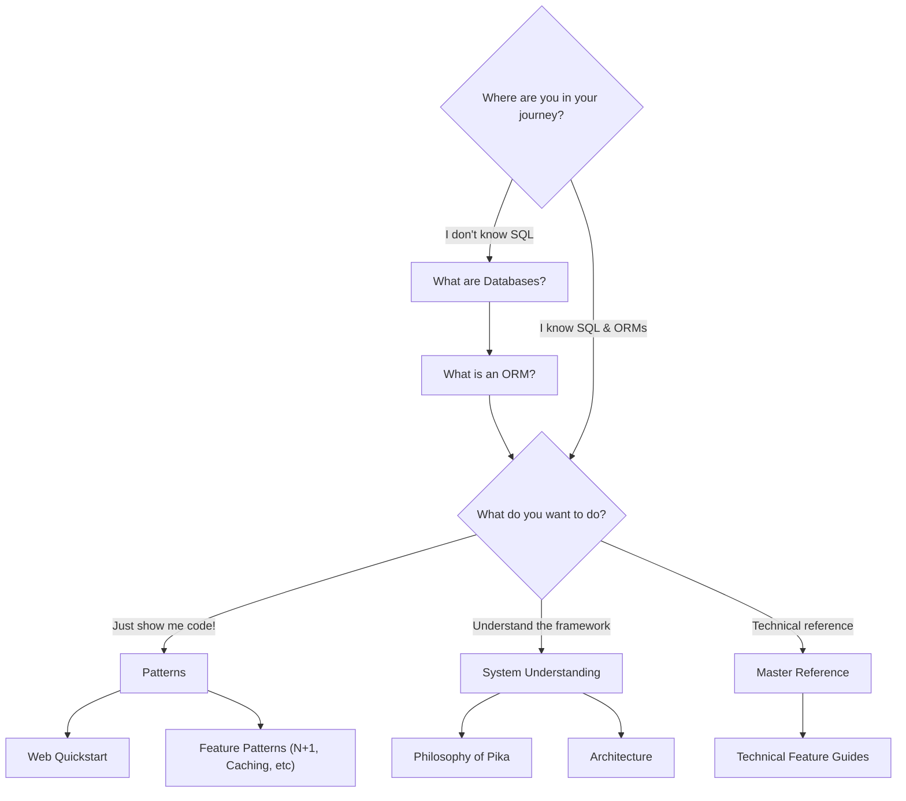

  

    🐭 Getting Started
    <h1>Welcome to PikaORM</h1>
    

      The lightweight MicroORM for Java — <em>no config files</em>, no magic, just clean
      builder-style API over plain SQL.
    

  

  

    Micro ORM
    
    
    
    ⚡
  

  
🚫<strong>0</strong> config files

  
🏗️<strong>Builder</strong> API

  
☕<strong>Pure</strong> Java

  
🗃️<strong>Raw SQL</strong> friendly

  
🌊<strong>Streaming</strong> support

PikaORM is a lightweight Object Relational Mapper for Java. Check out our [Philosophy of Pika](/pages/philosophy/) to see why we built it the way we did.

## Core Essentials

**1. Concision is key.**
Pika approaches the ORM problem with simplicity:
- No external configuration files or annotations.
- Intuitive builder method-based API design.
- Highly customizable mappings, models, and features — all using plain Java classes.
- An easy-to-understand codebase for personal modification.

**2. Pika exposes SQL.**
If you cannot do something simplistically with Pika logic, you are encouraged to use raw SQL. You are given multiple entry points to do this directly within the ORM.

**3. Dual database mapping paradigms.**
Pika provides both a SQL-native paradigm and a POJO (Plain Old Java Object) leaning side. These are not mutually exclusive — you are encouraged to use both approaches as your domain requires.

## Supported Databases

- **SQLite** — Use `.withSQLiteQuirks()` on ORM configuration for small corner cases.
- **H2** — Supports In-Memory, Oracle, PostgreSQL, and SQLServer dialects.
- **MariaDB** — Supported with standard JDBC usage.

## Where Should I Start?

Are you new to databases or ORMs? Check out our beginner guides first. If you already know SQL and ORMs, the chart below will point you to what you need.

<nav class="page-nav">
  
  /
  <a class="nxt" href="/pages/quickstart/">
    
Next →Web QuickStart

    🚀
  </a>
</nav>
