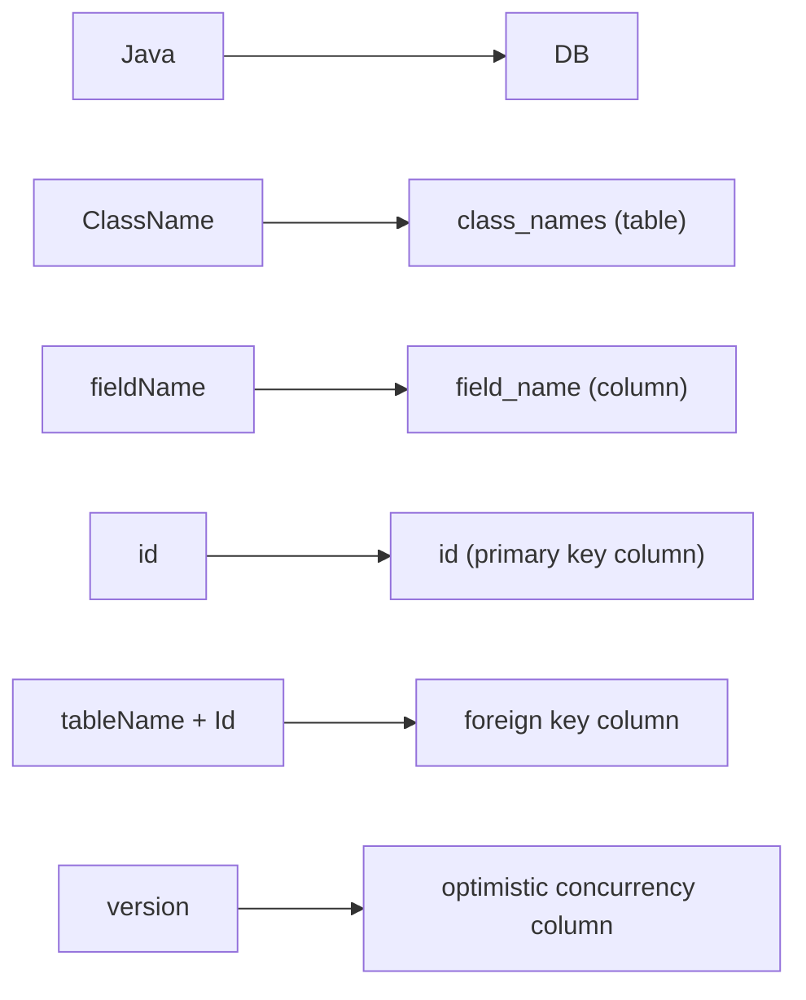

# PikaORM Web Quickstart

This is your one-stop guide to get a working Java web application talking to a database with PikaORM. We cover the essentials in order: migrations, your domain object, and all four CRUD operations, finishing with joins.

PikaORM is designed to be highly discoverable. Almost everything is accessible through method chaining, and there are no external configuration files or annotations required.

## Setting Up Migrations

Migrations are how you define and manage your database schema entirely in code. You create a class that extends `Migrations`, override the `migrations()` method, and add one `PikaMigration` entry per schema change.

```java
public class AppMigrations extends Migrations {

    @Override
    public void migrations() {
        add(this::createTodosTable);
    }

    public PikaMigration createTodosTable() {
        return makeMigration("001_create_todos")
                .up("""
                        CREATE TABLE IF NOT EXISTS todos (
                            id        INTEGER PRIMARY KEY,
                            title     TEXT,
                            description TEXT,
                            due_date  TEXT,
                            completed INTEGER
                        );
                        """)
                .down("DROP TABLE todos;");
    }
}
```

`migrations()` is called by Pika to collect your migration definitions. Each call to `add()` registers one `PikaMigration`: a named unit of work with an `up` (apply) and `down` (rollback) SQL block. You write your own DDL; Pika handles execution order, tracking, and idempotency.

> [!NOTE]
> `up` and `down` are standard migration conventions. Pika records every applied migration in a `pika_migrations` table, so re-running `applyAll()` is always safe since already-applied migrations are skipped automatically.

Multiple SQL statements within a single `up` or `down` block are supported. Separate them with semicolons and Pika will execute each one in order within a transaction.

## Wiring the ORM to Your Migrations

You have two options for applying migrations at startup.

**Option A: Apply immediately (typical for a web server startup)**

```java
public static void main(String[] args) {
    PikaORM orm = new PikaORM("jdbc:sqlite:app.db")
            .withLogLevel(TRACE)
            .makeDefaultORM()
            .withMigrations(new AppMigrations())
            .applyMigrations();
}
```

**Option B: Interactive CLI (useful during development)**

```java
public static void main(String[] args) {
    PikaORM orm = new PikaORM("jdbc:sqlite:app.db")
            .withLogLevel(TRACE)
            .makeDefaultORM();

    AppMigrations migrations = new AppMigrations();
    orm.withMigrations(migrations);
    migrations.console(); // boots an interactive CLI
}
```

The console gives you fine-grained control:

```text
migrations > ?
Migrations Commands
  show      - show all migrations and their status
  up        - apply the next pending migration
  down      - roll back the most recently applied migration
  all       - apply all pending migrations
  exit/quit - exit this tool
  help/?    - show this help message
```

## Your Domain Object

A domain object in Pika is a **plain Java class**. No base class or interface is required. Pika reads and writes fields directly via reflection, so all you need is a no-arg constructor and your fields.

```java
public class Todo {

    Long id;
    String title;
    String description;
    Date dueDate;
    Boolean completed;

    public Todo() {}

    public Todo(String title, String description) {
        this.title = title;
        this.description = description;
    }

    public Long getId()                     { return id; }
    public String getTitle()               { return title; }
    public void setTitle(String title)     { this.title = title; }
    public String getDescription()         { return description; }
    public void setDescription(String d)   { this.description = d; }
    public Date getDueDate()               { return dueDate; }
    public void setDueDate(Date dueDate)   { this.dueDate = dueDate; }
    public Boolean getCompleted()          { return completed; }
    public void setCompleted(Boolean c)    { this.completed = c; }
}
```

> [!NOTE]
> Getters and setters are optional for Pika itself, as it accesses fields directly. They are shown here because your web framework or serialization library likely needs them.

## Default Database Mapping

Pika automatically converts between Java naming conventions and SQL conventions. You do not need to configure anything for a fresh database.



So `Todo` maps to the `todos` table, and `dueDate` maps to the `due_date` column automatically. If you are working with an existing database that uses different conventions, Pika provides a full suite of mapping overrides.

## Basic CRUD

### INSERT

```java
PikaORM orm = new PikaORM("jdbc:sqlite:app.db")
        .withLogLevel(TRACE)
        .makeDefaultORM()
        .withMigrations(new AppMigrations())
        .applyMigrations();

// Insert multiple rows in one database round-trip
orm.insertAll(Arrays.asList(
    new Todo("Buy groceries", "Milk, eggs, bread"),
    new Todo("Read docs",     "Finish the PikaORM guide"),
    new Todo("Write tests",   "Cover the happy path")
));

// Insert a single row - returns the generated primary key
Todo single = new Todo("Deploy app", "Push to production");
long generatedId = orm.insert(single);
// single.getId() is also updated automatically after insert
```

`insertAll` sends a single `INSERT` statement with multiple `VALUES` rows. This is much more efficient than calling `insert` in a loop when you have many objects. Any fields left `null` at insertion time are stored as `NULL` in the database.

### SELECT

**Typed query - results mapped directly to your class:**

```java
// All rows
PikaList<Todo> all = orm.find(Todo.class).all().toList();

// Filtered with a named parameter
PikaList<Todo> active = orm.query(Todo.class)
        .where("completed = :val", "val", false)
        .fetchList();

// Single object by primary key - returns null if not found
Todo todo = orm.find(Todo.class).byId(1L);

// Single object by any column
Todo byTitle = orm.find(Todo.class).byKey("title", "Buy groceries");
```

`orm.query()` returns a `PikaClassQuery`, which is a fluent builder you can chain `.where()`, `.orderBy()`, `.page()`, and other clauses onto before executing.

> [!IMPORTANT]
> The primary execution methods are:
> 
> - `.fetch()`: Returns a `QueryResult<T>`. This result set allows you to call `reload()`, `getAsReadOnlyList()`, or `copy()`. You must call `.toList()` to get a `PikaList`.
> - `.fetchList()`: A shortcut combining `.fetch()` and `.toList()`.
> 
> Example:
> ```java
> // Option A — two steps
> QueryResult<Todo> result = orm.query(Todo.class).where("completed = :val", "val", false).fetch();
> PikaList<Todo> list = result.toList();
> 
> // Option B — one step
> PikaList<Todo> list = orm.query(Todo.class).where("completed = :val", "val", false).fetchList();
> ```

**Named parameters** use the `:variableName` syntax inside your SQL string. Supply the value either inline, via a `Map`, or with `.withVar()`:

```java
// Three equivalent ways to supply a parameter
orm.query(Todo.class).where("title = :val", "val", "Buy groceries").fetchList();
orm.query(Todo.class).where("title = :val", Map.of("val", "Buy groceries")).fetchList();
orm.query(Todo.class).where("title = :val").withVar("val", "Buy groceries").fetchList();
```

**Raw SQL:**

```java
// No class mapped - rows come back as ResultMap (a Map<String, Object>)
PikaList<ResultMap> rows = orm.select("SELECT * FROM todos").toList();
String title = rows.get(0).getString("title");

// With a class - rows are mapped to your type
PikaList<Todo> todos = orm.select("SELECT * FROM todos WHERE completed = 0", Todo.class).toList();
```

If you do not map to a POJO, you receive a `ResultMap`. You must use default typed getters to extract data based on the database column name:

```java
ResultMap row = results.first();
Long id           = row.getLong("id");
String title      = row.getString("title");
Date dueDate      = row.getDate("due_date");
Boolean completed = row.getBoolean("completed");
```

### UPDATE

```java
// Fetch the object
Todo todo = orm.find(Todo.class).byId(1L);

// Mutate it
todo.setCompleted(true);
todo.setDueDate(new Date());

// Persist the change - returns true if a row was updated
boolean updated = orm.update(todo);
```

Pika builds an `UPDATE` statement covering every mapped field and targets the row by its primary key.

### DELETE

```java
Todo toRemove = orm.find(Todo.class).byId(1L);

// Returns true if the row was deleted, false if it wasn't found
boolean deleted = orm.delete(toRemove);
```

`delete` targets the row by the object's primary key value. Always fetch the object first (or ensure its `id` field is set). Deleting an object whose `id` is `null` is a no-op.

## Joins

When your data spans multiple tables, use `.join()` to pull them together in a single query. Pika auto-resolves the foreign key relationship between classes based on your mapping configuration.

```java
// Imagining Todo has a foreign key to Checklist, which has a foreign key to Calendar
PikaList<Todo> result = orm.query(Todo.class)
        .join(Checklist.class)       // JOIN todos -> checklists
        .thenJoin(Calendar.class)    // JOIN checklists -> calendars
        .where("todos.title = :title")
        .withVar("title", "Learn about PikaORM")
        .fetchList();
```

`.join(Class)` adds the first joined table. `.thenJoin(Class)` chains from the most recently joined table. The result type remains `PikaList<Todo>`, with Pika mapping the relevant columns back to your primary class.
