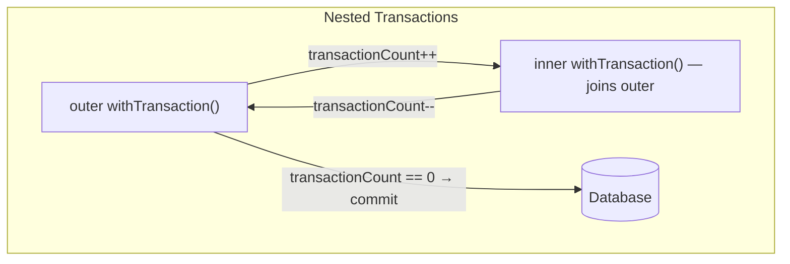

# Transactions

PikaORM handles transactions using a thread-local connection stack and simple lambda expressions. You execute blocks of code within a transaction wrapper, and PikaORM manages the connection lifecycle, commits, and rollbacks automatically.

## Transaction API Surface

There are three primary methods for executing code in a transaction:

### 1. `inTransaction` / `withTransaction`

These methods are aliases of each other. They execute the provided `Runnable` or `Callable` inside a transaction.
- If a transaction is already active on the current thread, it joins that transaction.
- If no transaction is active, it starts a new one.

```java
// Using Runnable (no return value)
orm.inTransaction(() -> {
    orm.insert(new User("Alice"));
    orm.insert(new User("Bob"));
}); // Automatically commits here if successful, rolls back if an exception is thrown

// Using Callable (returns a value)
User newAdmin = orm.withTransaction(() -> {
    User admin = new User("Charlie");
    orm.insert(admin);
    orm.insert(new Role(admin.getId(), "ADMIN"));
    return admin;
});
```

### 2. `forceTransaction`

Executes the provided block in a *completely isolated* transaction. It ignores any existing thread-local connection session, opens its own connection, and commits or rolls back independently of whatever else is happening on the thread.

```java
orm.inTransaction(() -> {
    orm.insert(foo);
    
    // This executes and commits immediately on a separate connection.
    // Even if the outer transaction rolls back, this log entry remains.
    orm.forceTransaction(() -> {
        orm.insert(new AuditLog("Created foo"));
    });
    
    if (somethingFails) throw new RuntimeException(); 
    // Outer transaction rolls back 'foo'. 'AuditLog' is unaffected.
});
```

### 3. `joinTransaction`

Executes the provided block *only if* a transaction is already active. If no transaction is currently open on the thread, it throws an `IllegalStateException`. This is useful for helper methods that absolutely must be run as part of a larger unit of work.

```java
public void updateStatus(Order order) {
    orm.joinTransaction(() -> {
        order.setStatus("SHIPPED");
        orm.update(order);
    });
}
```

## Nesting Semantics

PikaORM supports arbitrarily deep transaction nesting using a simple reference-counting mechanism.



When you nest `inTransaction` calls, the physical JDBC `COMMIT` statement is deferred until the outermost transaction completes successfully.

If an exception is thrown anywhere in the nested chain, it bubbles up. When the outermost transaction catches it, it issues a single physical `ROLLBACK`, undoing all operations.

```java
orm.inTransaction(() -> { // transactionCount = 1
    orm.insert(foo);
    
    orm.inTransaction(() -> { // transactionCount = 2
        orm.insert(bar); // Joining existing connection
    }); // transactionCount = 1 (No commit issued yet)
    
}); // transactionCount = 0 (Physical COMMIT issued here)
```

## Transaction Status

You can check if a transaction is currently active on the thread using:

```java
boolean active = orm.isInTransaction();
```
